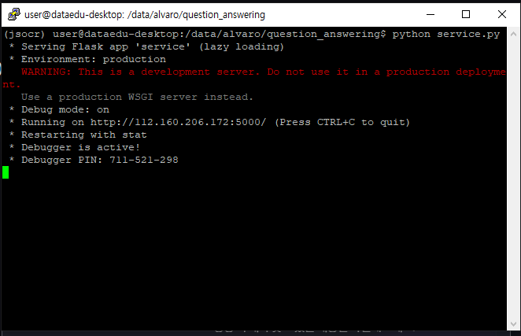
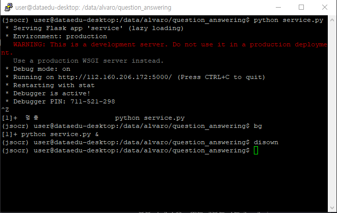
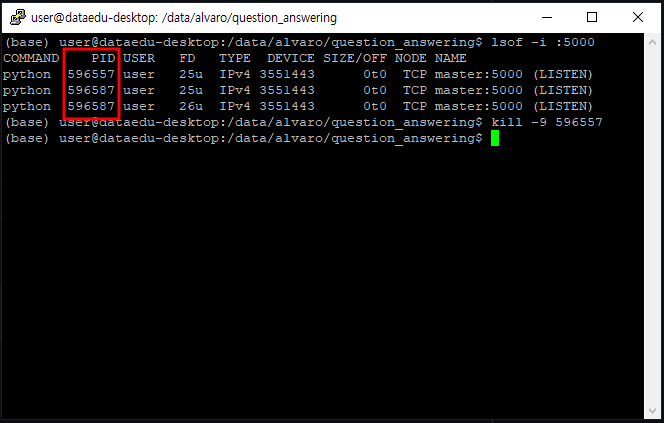

# 💬질의응답 서비스
</img>
</img><br>
## ⚖️정의
BERT 기반의 질의응답 모델로 <a href="https://www.dolearn.ai/"></img></a> 동영상 내용에 관련된 질문 응답을 제공하는 AI 질의응답 웹서비스이다.
## ▶설치
### 📥리포지터리 다운로드 받기
깃허브에서 로그인 한 후 다음 명령으로 리포지토리를 내려받으면 된다.
```
git clone https://github.com/youngdo1990/question_answering_service.git
```
### 📝필요한 디펜던시 설치
```
pip install -r requirements.txt
```
### 🔢가중치 내려받기
질의응답 모델을 이용하기 위해서 학습한 가중치가 필요한다. 모델의 가중치 바이나리 파일을 얻기 위한 단계는 다음과 같다.<br><br>

output 폴더로 이돈하기
```
cd ./output
```
pysftp 라이브러리 설치
```
pip install pysftp
```
get_model.py 실행하기
```
python get_model.py
```
## 🟢서비스 실행
### ▶서비스 실행하기
```
python service.py
```
</img>
### 💻백그라운드에서 실행하기
서비스 시작했는데 터미널 창 닫으면 서비스는 멈추게 된다. 터미널 창 상관 없이 서비스 Stand-by 유지하기 위해서 백그라운드로 실행하면 된다.<br>
1. <b>Ctrl+Z</b> 누르기.<br>
2. bg와 disown 명령 실행하기.<br>
```
bg
disown
```
</img><br>
3. 터미널 창 닫기.<br>
## 🔴서비스 멈추기
백그라운드에서 실행하고 있는 서비스를 멈추기 원하면 5000 포트에서 실행하고 있는 PID 확인한 후 kill 명령으로 프로세스를 멈추면 된다.<br>
</img><br>
1. PID 번호 확인하기
```
lsof -i :5000
```
2. 프로세스 멈추기
```
sudo kill -9 <PID>
```
2. 프로세스 멈추기
# 🛠제작자 및 🤝협조자
## 👩🏻‍💻연구개발:제작&테스트
알바로(채환희) 전임연구원👑<br>
